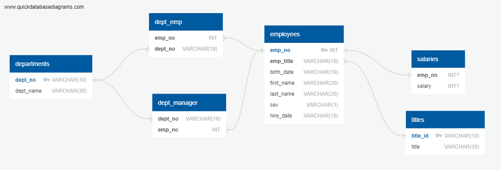
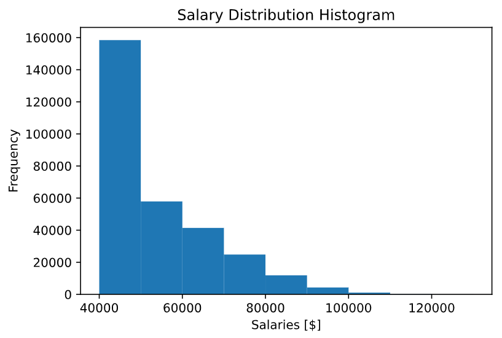
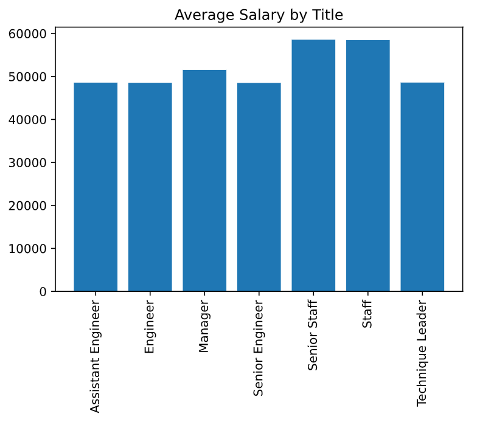

# SQL Project - Employee Database

## Task

In this project, an analysis is performed on employees of a corporation from the 1980s and 1990s. All that remains of the database of employees from that period are six CSV files.

For this purpose, a tables is created to hold data in the CSVs, import the CSVs into a SQL database, and answer questions about the data through performing the following steps:

1. Data Engineering

2. Data Analysis

#### Data Engineering

An ERD diagram is sketched of the tables obtained in the CSV files using a tool like [http://www.quickdatabasediagrams.com](http://www.quickdatabasediagrams.com).

* Each CSV file is imported into the corresponding SQL table. 

#### Data Analysis

1. The following details of each employee are listed: employee number, last name, first name, sex, and salary.

2. First name, last name, and hire date for employees who were hired in 1986 are listed.

3. The manager of each department with the following information are listed: department number, department name, the manager's employee number, last name, first name.

4. The department of each employee with the following information are listed: employee number, last name, first name, and department name.

5. First name, last name, and sex for employees whose first name is "Hercules" and last names begin with "B." are listed.

6. All employees in the Sales department, including their employee number, last name, first name, and department name are listed.

7. All employees in the Sales and Development departments, including their employee number, last name, first name, and department name are listed.

8. In descending order, the frequency count of employee last names, i.e., how many employees share each last name are listed.

9. A histogram plot is displayed to visualise the most common salary ranges for employees.

10. A bar chart is created of average salary by title.

